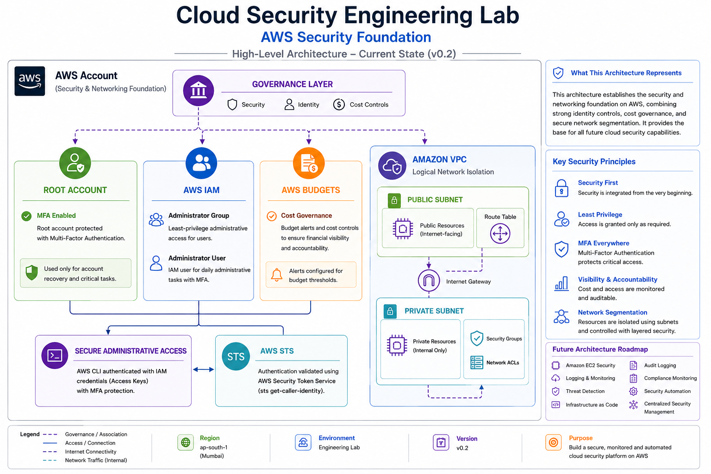

# Architecture

## Overview

This document describes the architecture of the Cloud Security Engineering Lab. The environment is designed using a security-first approach, where foundational security controls are established before deploying workloads or enabling advanced cloud services.

The architecture evolves incrementally as new security capabilities are implemented. Each phase builds upon the existing foundation while maintaining security, operational visibility, governance, and defense-in-depth.

---

## Architecture Metadata

| Property | Value |
|----------|-------|
| **Current Version** | v0.2 |
| **Status** | Security & Networking Foundation Complete |

---

## Current Architecture

The current implementation establishes the security and networking foundation of the AWS environment.

### Implemented Components

- AWS Account
- Root Account Protection (Multi-Factor Authentication)
- Identity & Access Management (IAM)
  - Administrator Group
  - Administrator User
- AWS Budgets
- AWS CLI
- AWS Security Token Service (STS)
- Amazon Virtual Private Cloud (VPC)
- Public Subnet
- Private Subnet
- Internet Gateway
- Route Tables
- Security Groups
- Network ACLs

---

## Security Architecture

The current security architecture is based on five foundational principles:

### 1. Privileged Account Protection

- Root account secured with Multi-Factor Authentication (MFA).
- Root account reserved exclusively for emergency administrative operations.

### 2. Identity-Based Administration

- Daily administrative tasks performed using IAM identities.
- Separation maintained between emergency and operational access.

### 3. Cost Governance

- AWS Budgets configured before provisioning additional resources.
- Spending visibility established from the beginning of the project.

### 4. Authenticated Programmatic Access

- AWS CLI configured using IAM credentials.
- Authentication validated through AWS Security Token Service (STS).

### 5. Secure Network Segmentation

- Amazon VPC provides logical network isolation for cloud resources.
- Public and private subnets separate internet-facing and internal workloads.
- Route Tables and the Internet Gateway control network traffic flow.
- Security Groups and Network ACLs provide layered network security.

---

## Architecture Diagram

The diagram below illustrates the current cloud security architecture, including identity management, governance, and secure network segmentation (Architecture v0.2).

---

## Future Architecture

The architecture will continue to evolve as additional cloud security capabilities are implemented, including:

- Amazon EC2 Security
- Audit Logging (AWS CloudTrail)
- Security Monitoring (Amazon CloudWatch)
- Compliance Monitoring (AWS Config)
- Threat Detection (Amazon GuardDuty)
- Centralized Security Management (AWS Security Hub)
- Infrastructure as Code (AWS CloudFormation / Terraform)
- Security Automation

Each capability will be integrated into the existing architecture while preserving a security-first design.