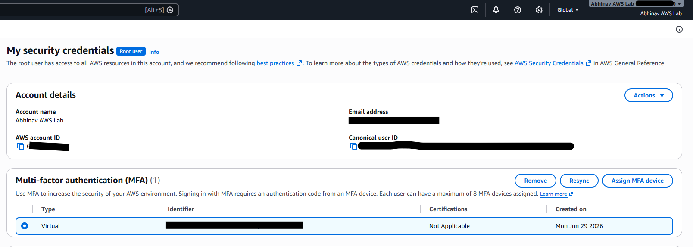
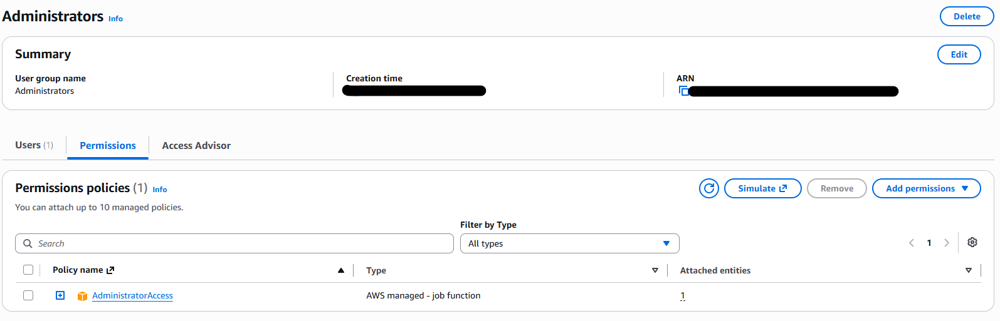
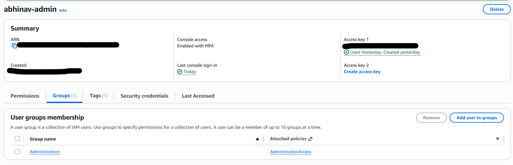
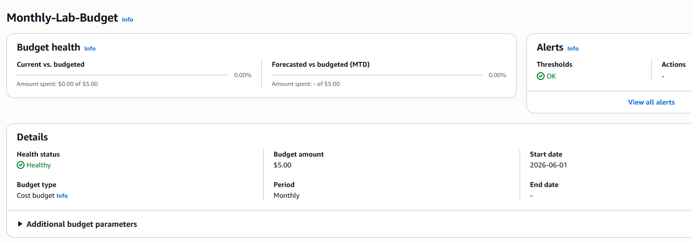
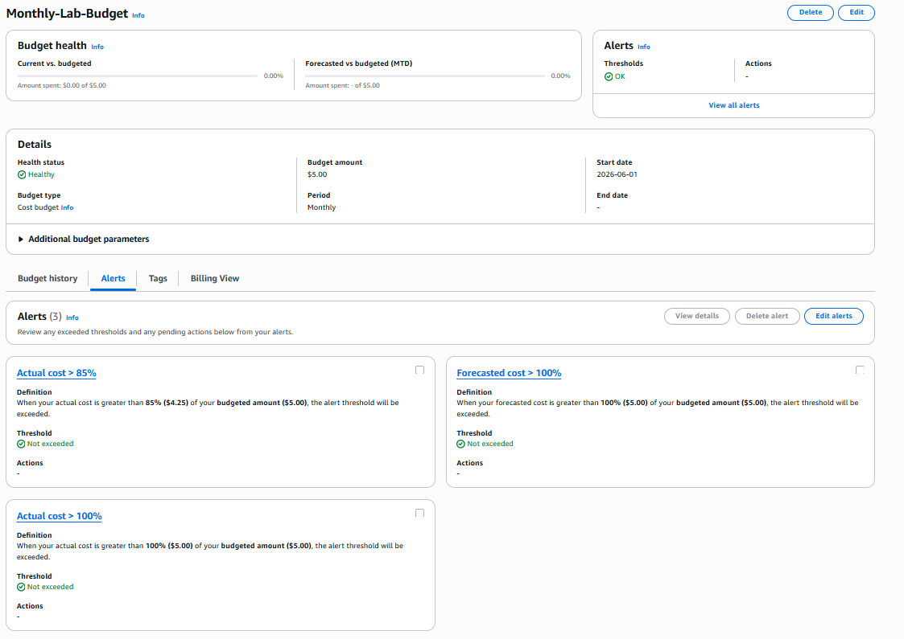
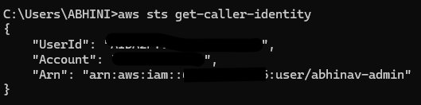

# Lab 31 – AWS Security Foundation

## Overview

This lab establishes the foundational security controls for the Cloud Security Engineering Lab by securing a newly created AWS account and implementing identity, governance, and authenticated administrative access.

Rather than provisioning workloads immediately, the lab focuses on building a secure operational baseline that aligns with AWS security best practices. These foundational controls provide the platform upon which all subsequent cloud security capabilities will be implemented.

---

## Objectives

- Secure the AWS root account using Multi-Factor Authentication (MFA).
- Implement IAM-based administration following the principle of least privilege.
- Configure AWS Budgets for proactive cost governance.
- Establish secure programmatic access using the AWS CLI.
- Validate implemented controls through AWS Management Console configuration and AWS CLI verification.

---

## Implemented Components

- AWS Account
- Root Account Protection (Multi-Factor Authentication)
- AWS Identity and Access Management (IAM)
  - Administrator Group
  - Administrator User
- AWS Budgets
- AWS CLI
- AWS Security Token Service (STS)

---

## Implementation Summary

| Component | Purpose | Status |
|-----------|---------|:------:|
| AWS Account | Establish the cloud environment | ✅ |
| Root MFA | Protect the most privileged account | ✅ |
| IAM Administration | Enable least-privilege administrative access | ✅ |
| AWS Budgets | Establish cost governance | ✅ |
| AWS CLI | Enable authenticated programmatic administration | ✅ |
| AWS STS Validation | Verify authenticated CLI access | ✅ |

---

## Validation Evidence

The implementation was validated through the successful configuration of the following components:

- AWS Management Console configuration
- Root account MFA verification
- IAM Administrator Group and User configuration
- AWS Budgets configuration
- Successful execution of `aws sts get-caller-identity`

---

## Implementation Evidence

### Step 1 – Secure the AWS Root Account

The AWS root account was secured by enabling Multi-Factor Authentication (MFA), protecting the most privileged identity within the AWS environment.

---

### Step 2 – Configure IAM Administration

An Administrator Group and Administrator User were created to separate day-to-day administration from the root account and implement centralized permission management.

**Administrator Group**

**Administrator User**

---

### Step 3 – Configure AWS Budgets

AWS Budgets were configured to establish proactive cost governance and provide notifications for budget thresholds.

---

### Step 4 – Validate AWS CLI Authentication

Programmatic access was validated using AWS Security Token Service (STS) to confirm successful authentication through the AWS CLI.

---

## Key Engineering Decisions

The following engineering decisions were established during this lab:

- Protect privileged identities before deploying cloud resources.
- Perform routine administration using IAM identities instead of the root account.
- Establish governance before provisioning infrastructure.
- Validate programmatic access early to support future automation.

Detailed design rationale is available in:

- `../../docs/design-decisions.md`

---

## Documentation

Additional documentation for this implementation is available in:

- `../../docs/architecture.md`
- `../../docs/design-decisions.md`
- `../../docs/interview-notes.md`
- `../../docs/lessons-learned.md`

---

## Outcome

Lab 31 establishes the secure foundation for the Cloud Security Engineering Lab. With identity management, governance, and authenticated administrative access successfully implemented, the environment is prepared for secure networking, cloud infrastructure deployment, monitoring, logging, Infrastructure as Code, and advanced cloud security services in subsequent labs.