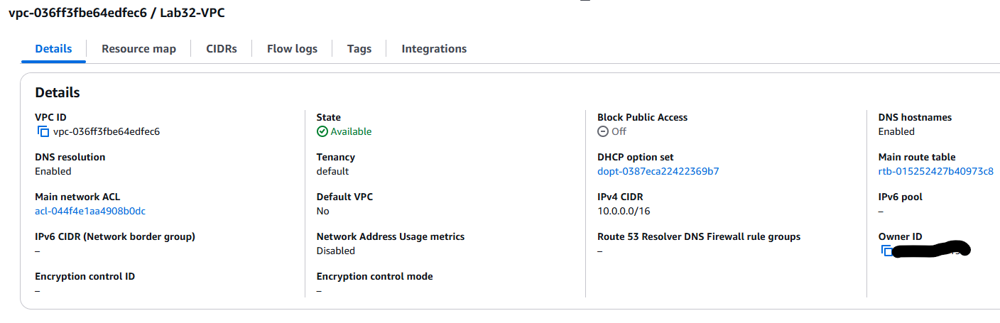
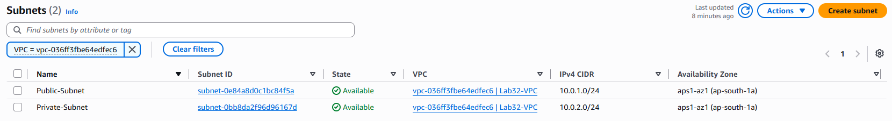
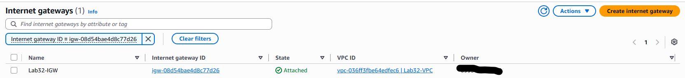
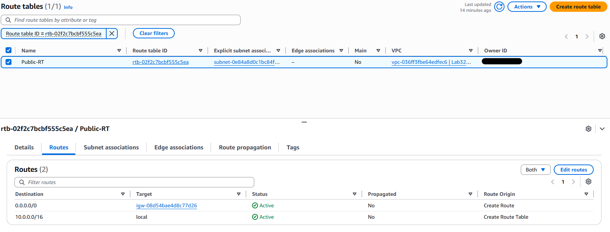
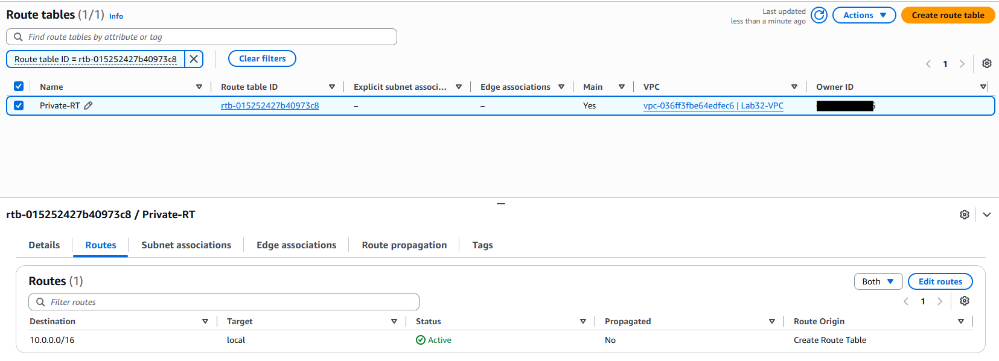
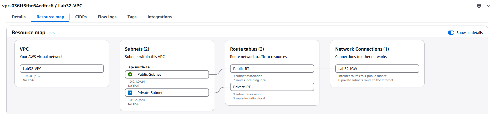

# Lab 32 – AWS Networking Foundation

## Overview

This lab establishes the networking foundation for the Cloud Security Engineering Lab by building a custom Amazon Virtual Private Cloud (VPC) instead of relying on the default AWS networking configuration.

The implementation introduces network segmentation through public and private subnets, controlled internet connectivity using an Internet Gateway and Route Tables, and layered network security using Security Groups and Network ACLs. Together, these components establish a secure, scalable networking foundation for future cloud workloads.

This networking foundation prepares the environment for deploying secure compute resources, implementing monitoring and logging, and integrating advanced cloud security services in subsequent labs.

---

## Objectives

- Build a custom Amazon Virtual Private Cloud (VPC).
- Create public and private subnets for network segmentation.
- Configure internet connectivity using an Internet Gateway.
- Configure public and private Route Tables.
- Understand the role of Security Groups and Network ACLs in AWS networking.
- Validate the complete network topology using the AWS Resource Map.

---

## Implemented Components

- Amazon Virtual Private Cloud (VPC)
- Public Subnet
- Private Subnet
- Internet Gateway
- Public Route Table
- Private Route Table
- Security Groups
- Network ACLs

---

## Implementation Summary

| Component | Purpose | Status |
|-----------|---------|:------:|
| Custom VPC | Isolate cloud resources within a dedicated network | ✅ |
| Public Subnet | Host internet-facing resources | ✅ |
| Private Subnet | Provide an isolated network segment for internal workloads | ✅ |
| Internet Gateway | Enable controlled internet connectivity | ✅ |
| Public Route Table | Route internet-bound traffic through the Internet Gateway | ✅ |
| Private Route Table | Restrict direct internet access for private resources | ✅ |
| Security Groups | Provide stateful instance-level traffic filtering | ✅ |
| Network ACLs | Provide stateless subnet-level traffic filtering | ✅ |

---

## Validation Evidence

The networking implementation was validated through the successful configuration of the following components:

- Custom Amazon VPC
- Public and Private Subnets
- Internet Gateway attachment
- Public Route Table configuration
- Private Route Table configuration
- End-to-end network topology validation using the AWS Resource Map

---

## Implementation Evidence

### Step 1 – Create the Amazon VPC

A custom Amazon VPC was created with a dedicated IPv4 CIDR block to provide an isolated networking environment.

---

### Step 2 – Configure Public and Private Subnets

Public and private subnets were created to implement network segmentation within the VPC.

---

### Step 3 – Attach an Internet Gateway

An Internet Gateway was attached to the VPC to enable controlled internet connectivity for public resources.

---

### Step 4 – Configure Route Tables

Separate Route Tables were configured for public and private subnets. The public Route Table contains a default route to the Internet Gateway, while the private Route Table contains only the local VPC route.

**Public Route Table**

**Private Route Table**

---

### Step 5 – Validate the Network Architecture

The AWS Resource Map provides a consolidated view of the completed networking architecture, illustrating the relationships between the VPC, subnets, Route Tables, and Internet Gateway.

---

## Key Engineering Decisions

The following engineering decisions were established during this lab:

- Build a custom VPC instead of using the AWS Default VPC.
- Separate workloads using public and private subnets.
- Control internet connectivity through explicit Route Table configuration.
- Apply layered network security using Security Groups and Network ACLs.
- Design the networking foundation to support future cloud workloads securely.

Detailed design rationale is available in:

- `../../docs/design-decisions.md`

---

## Documentation

Additional documentation for this implementation is available in:

- `../../docs/architecture.md`
- `../../docs/design-decisions.md`
- `../../docs/interview-notes.md`
- `../../docs/lessons-learned.md`

---

## Outcome

Lab 32 establishes the networking foundation for the Cloud Security Engineering Lab. With a custom Amazon VPC, segmented subnets, controlled internet connectivity, and layered network security successfully implemented, the environment is prepared for secure compute deployment, monitoring, logging, and advanced cloud security capabilities in subsequent labs.